# O projekcie

*Warszawskie Kroje* to niekomercyjny projekt, w wyniku którego powstała seria dwunastu nowych krojów pism, stworzonych w oparciu o charakter warszawskiego liternictwa. W projekcie wzięli udział wybrani młodzi projektanci, pracujący pod okiem najbardziej doświadczonych polskich typografów.

## Czy miasto ma swój charakter pisma?

Inspiracją i podstawą dla Warszawskich Krojów jest liternictwo warszawskiej ulicy. Interesowała nas przede wszystkim typografia wernakularna – a więc tworzona rękami amatorów i rzemieślników.  Zanim ulice zostały zdominowane przez globalne marki i banalne projekty oparte na popularnych fontach, odręczne i rzemieślnicze liternictwo było najpowszechniejszą formą grafiki w przestrzeni publicznej. Twórcy tych napisów inspirowali się wzajemnie, dlatego powstawały mody i "mikro-style", mające silnie lokalny charakter. Z każdym dniem na ulicach zostaje ich coraz mniej. Przeważnie są to jednorazowe realizacje, nieoparte na istniejących czcionkach. Te napisy, wykonane różnymi technikami, rzadko posiadają jakąkolwiek dokumentację oprócz przypadkowych zdjęć – kiedy znikają z witryn, wywieszek i tablic, zazwyczaj znikają bezpowrotnie.

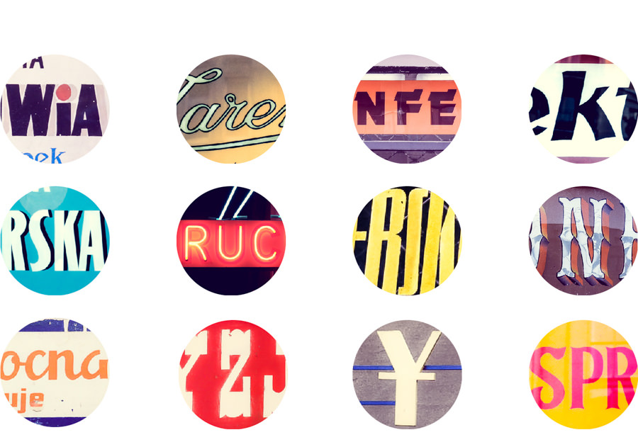

Warszawskie Kroje – fragmenty liternictwa z dokumentacji projektu
Fot. Franciszek Cieślak

Przy tworzeniu Warszawskich Krojów inspirowaliśmy się modernistycznymi neonami, ręcznie wykonanymi szyldami, reklamami i muralami z czasów PRL, kamiennymi tablicami, typografią ogłoszeń, dawnej numeracji budynków, czy wywieszek informacyjnych na klatkach schodowych i w zakładach. Przeczesaliśmy miejskie zaułki i dokumentalne archiwa. Staraliśmy się odszukać i utrwalić najciekawsze i najbardziej charakterystyczne okazy, tradycje i trendy stołecznej typografii, od początku XX wieku, aż do dziś.  Z tych poszukiwań powstał całkiem spory zbiór zdjęć. Cała nasza dokumentacja, podobnie jak fonty, dostępna jest na otwartej licencji.

Celem naszego projektu nie było jedynie cyfrowe odtworzenie historycznych krojów, ale przede wszystkim opracowanie nowych propozycji. Tak powstało 12 nowych, oryginalnych krojów pism, inspirowanych warszawskim charakterem pisma.

# Proces

## Research

Projekt Warszawskie Kroje zaczęliśmy otwartymi wykładami, wprowadzającymi w kontekst miejskiej typografii. Varsavianista Jarosław Zieliński przybliżył nam jak wyglądało liternictwo na ulicach Warszawy przedwojennej. Agata Szydłowska, krytyczka dizajnu, opowiedziała o kontekście projektowania inspirowanego typografią wernakularną.

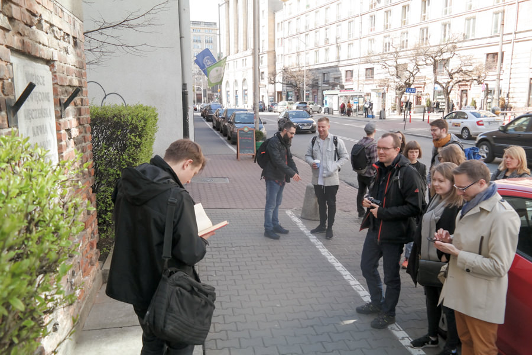

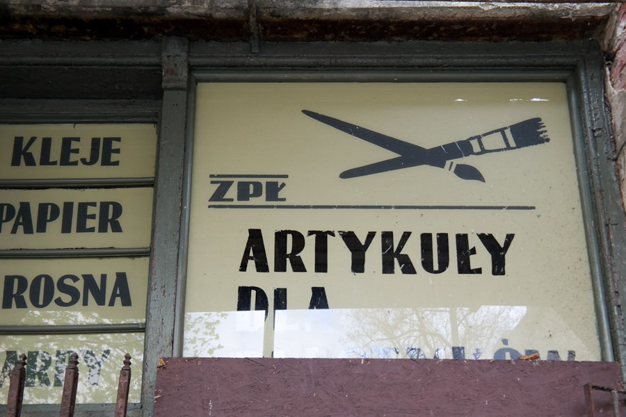

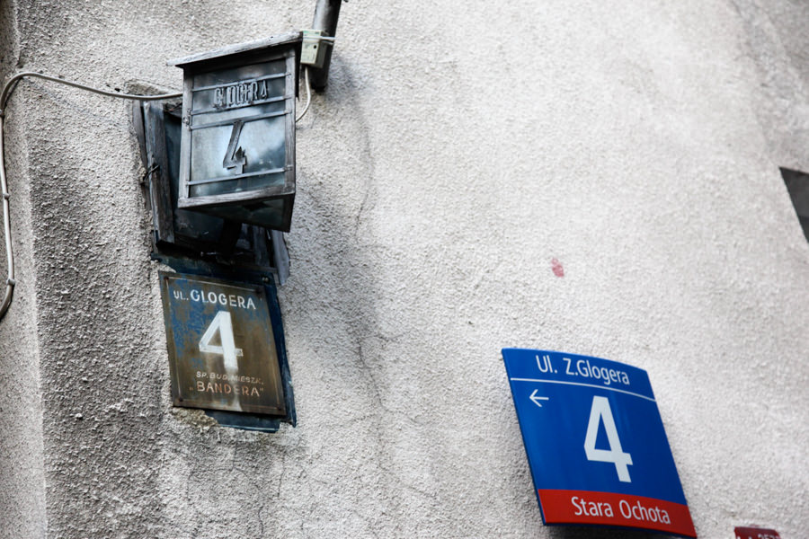

Badania miejskiej typografii – spacery
Marzec 2016
Fot. Rene Wawrzkiewicz i Franciszek Cieślak

Kolejnym etapem były badania wizualne. Wyruszyliśmy w miasto. Trasy spacerów wiodły przez Pragę Północ, Wolę, Śródmieście, Mokotów. Do dyspozycji uczestników była również dokumentacja Franciszka Cieślaka ze stowarzyszenia Miastodwa, który od kilku lat fotografuje miejską typografię. Muzeum Sztuki Nowoczesnej udostępniło nam także swoje materiały, wśród których znajdują się m.in. archiwalne projekty spółdzielni "Reklama" – wykonawcy większości Warszawskich neonów z lat 1960 – 1989. Korzystaliśmy też z książki *Technika Liternictwa* Jana Wojeńskiego. Podręcznik ten miał wiele wydań i przez 40 lat był głównym źródłem wiedzy i inspiracji dla profesjonalnych literników, szyldziarzy i amatorów wykonujących napisy odręcznie.

## Warsztaty projektowe

Sam proces projektowania nowych krojów trwał w sumie osiem miesięcy. Co około dwa tygodnie spotykaliśmy aby wspólnie omówić pomysły i kierunki, zrobić korekty i podyskutować. Przez cały czas nad jakością powstających krojów czuwał Michał Jarociński, ale rotacyjnie dołączali do zespołu także inni typografowie: Viktorija Grabowska, Łukasz Dziedzic i Adam Twardoch.

Pierwsze spotkania w marcu i w kwietniu odbywały się w PaństwoMiasto. Na tym etapie uczestnicy warsztatów mieli za zadanie wybrać kierunki dla swoich projektów i odpowiedzieć sobie na kluczowe  pytania: co to oznacza, że krój pisma może być Warszawski? Czy styl typograficzny może mieć aż tak lokalny charakter? Zadanie jakie zostało postawione przed projektantami było bardzo specyficzne, a etap badań wizualnych podsuwał konkretne inspiracje. Pomimo to, nie chcieliśmy narzucać żadnych rozwiązań, a interpretacja zadania była w pełni otwarta. W międzyczasie powstawało wiele szkiców i ciekawych interpretacji.

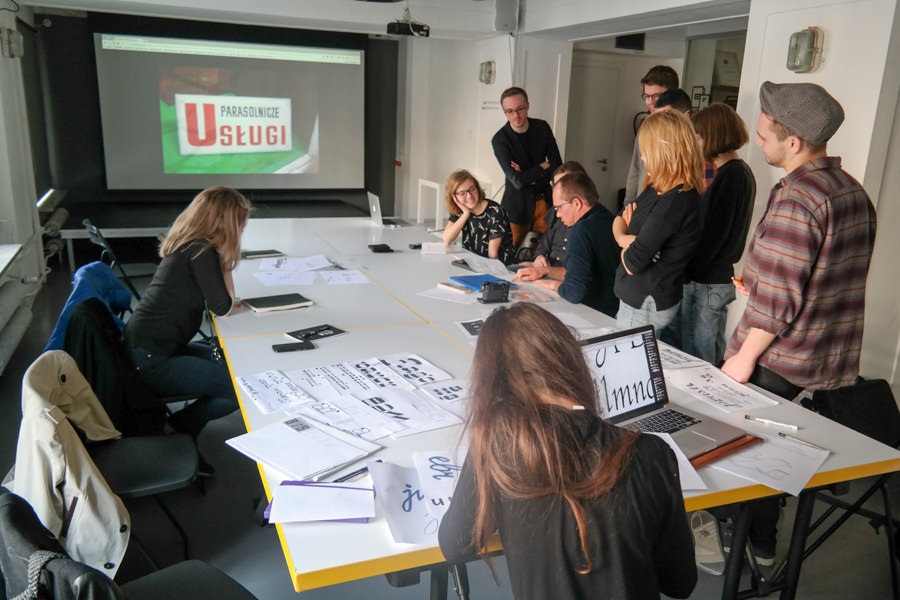

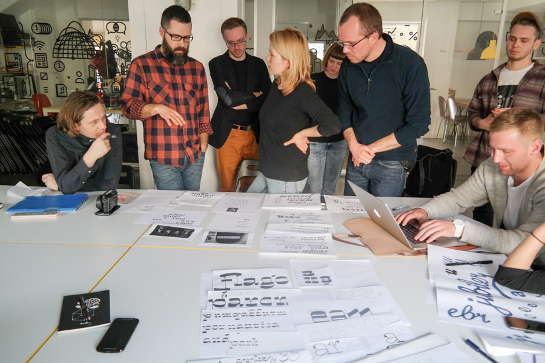

Warsztaty w PaństwoMiasto – dyskusje, szkice i praca koncepcyjna
Marzec 2016
Fot. Franciszek Cieślak

Wiosną i latem, gdy zrobiło się cieplej, przenieśliśmy się do ogrodów domków fińskich w Otwartym Jazdowie. Pracowaliśmy zazwyczaj na świeżym powietrzu. Na tym etapie kroje zaczęły nabierać już bardzo konkretnych kształtów. Odpowiedzi na pytanie: czym może być warszawski font, były zaskakująco różnorodne. Niektórzy projektanci skupili się na poszukiwaniu esencji stylu. Ich projekty były oparte na najciekawszych, powtarzalnych elementach typograficznych, które przewijały się w naszej dokumentacji. Powstały w ten sposób charakterystyczne display'owe kroje jak Zakład, Praho, Apropal czy Cyrulik. Źródłem inspiracji były też odręczne "pisanki" oraz lekkie liternictwo neonów – m.in Bajaderka, Havana, ale także modułowy Lombard choć połączony jest z blokowym stylem liter szyldów tabliczkowych. Tagger nawiązuje do ulicznego grafitti. Olympic jest oryginalną hybrydą odręcznego liternictwa szyldowego i rytych kamiennych tablic. Magiel eksploruje nonszalanckie błędy i humor wernakularnej typografii. Praktyczny Rewir jest natomiast odpowiedzią na swoiste zapotrzebowanie Warszawy na porządny way-finding'owy krój urzędowy. Nocturne to konceptualny projekt alfabetu opartego na przedwojennym liternictwie hebrajskim, ale też silnie nawiązujący do stylu powojennych tablic upamiętniających.

## 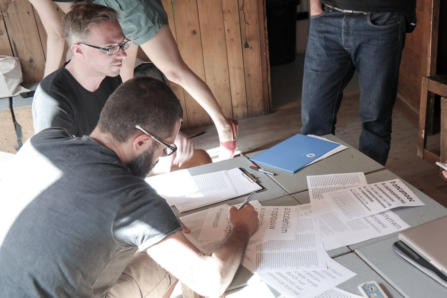

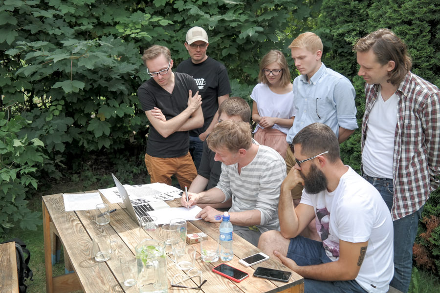

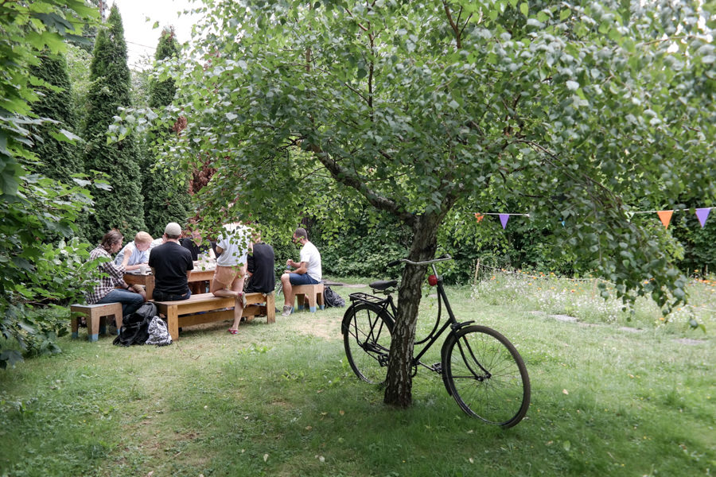

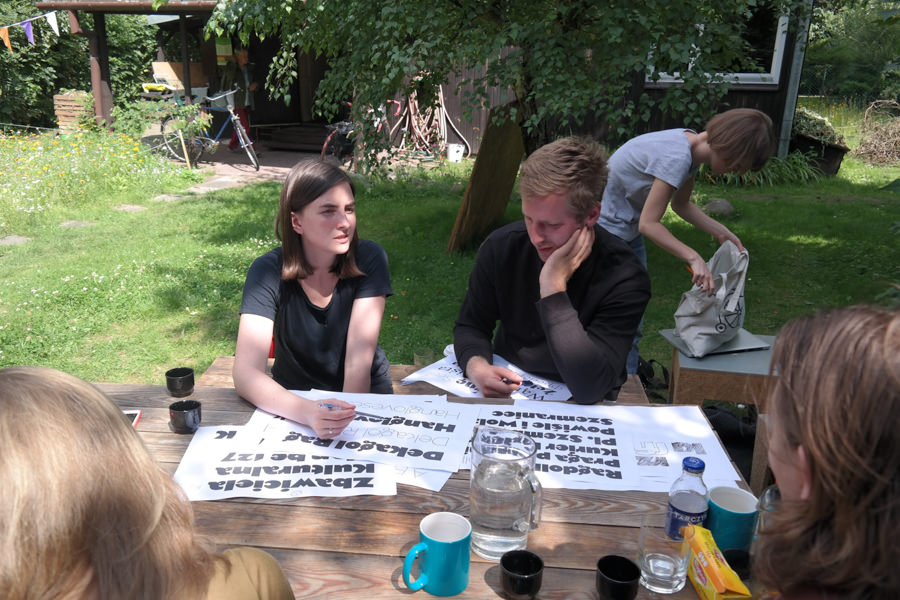

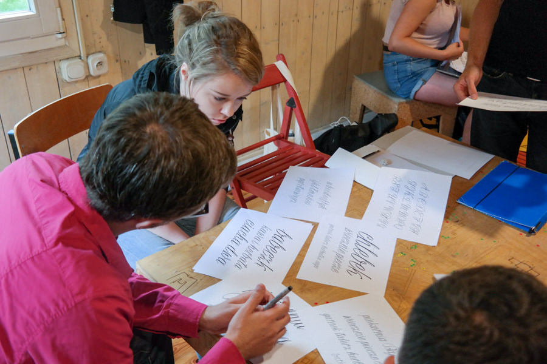

Warsztaty w Otwartym Jazdowie
Maj – Wrzesień 2016
Fot. Franciszek Cieślak

## ATypI 2016

*Warszawskie Kroje* zostały po raz pierwszy zaprezentowane na międzynarodowej konferencji typograficznej ATypI, która w 2016 roku odbyła się w Warszawie. Przy tej okazji wydaliśmy też mały katalog, który można pobrać [tutaj](https://issuu.com/miastodwa/docs/wkroje-broszura-en)

## Wystawa

12 listopada 2016 roku otworzyliśmy wystawę *Warszawskich Krojów* w Muzeum Warszawskiej Pragi. Wtedy też fonty zostały oficjalnie opublikowane i udostępnione szerokiej publiczności.

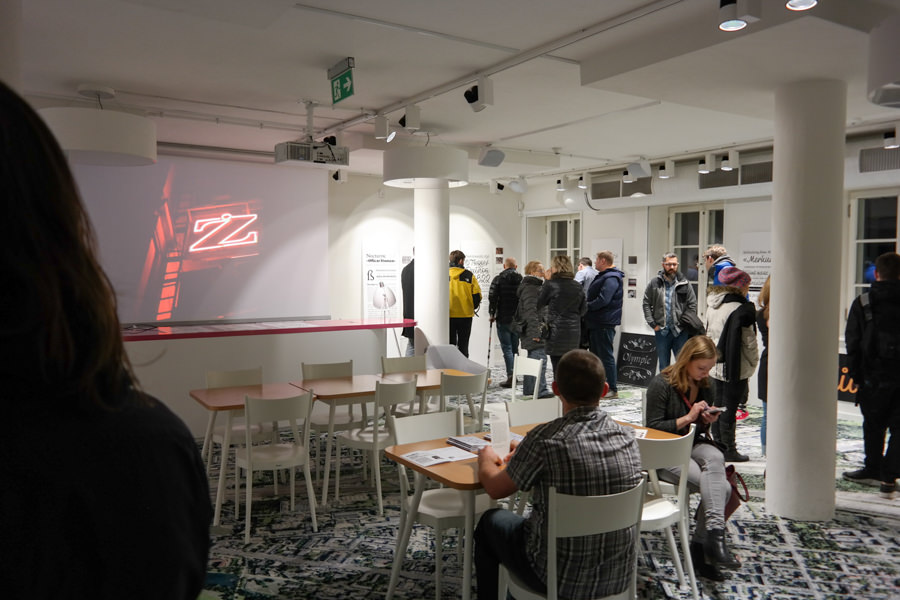

Wystawa *Warszawskie Kroje* w Muzeum Warszawskiej Pragi
Listopad 2016
Fot. Franciszek Cieślak

# Kto za tym stoi

*Warszawskie Kroje* powstały z inicjatywy Stowarzyszenia Miastodwa i Marcina Wawrzkiewicza.

JAN FRANCISZEK CIEŚLAK
Kurator i koorynator projektu „Warszawskie Kroje”. Projektant graficzny, programista, aktywista miejski. Współzałożyciel Stowarzyszenia Kulturotwórczego Miastodwa. Zajmuje się badaniem tożsamości wizualnej miasta i projektowaniem komunikacji. Prowadzi projekty łączące dizajnerów, badaczy i miejskich aktywistów.

MARCIN WAWRZKIEWICZ
Kurator i koorynator projektu „Warszawskie Kroje”. Projektant graficzny, researcher i kurator dizajnu. Współzałożyciel studia projektowego Mamastudio, Pracowni Krytyki Dizajnu i Stowarzyszenia Twórców Grafiki Użytkowej. Pomysłodawca, animator i organizator wielu wydarzeń, związanych ze sceną projektowania graficznego w Polsce, między innymi: festiwalu „Targi Wiedzy Graficznej”, prezentacji polskich projektantów na konferencji „TypoBerlin”, wystawy „TypoPolo” i „Druga Ogólnopolska Wystawa Znaków Graficznych”.

MICHAŁ JAROCIŃSKI
Mentor i opiekun merytoryczny projektu „Warszawskie Kroje”. Absolwent Wydziału Grafiki Akademi Sztuk Pięknych w Warszawie. Projektant krojów pism, jeden z nielicznych zawodowych literników w Polsce. Od dziesięciu lat prowadzi Dada Studio. Wykładowca projektowania krojów na Akademi Sztuk Pięknych w Warszawie.
[dadastudio.pl](http://dadastudio.pl)

Warsztaty projektowe prowadzili także:

Viktorija Grabowska
Łukasz Dziedzic
Adam Twardoch

Wykłady towarzyszące prowadzili:

Jarosław Zieliński
Agata Szydłowska